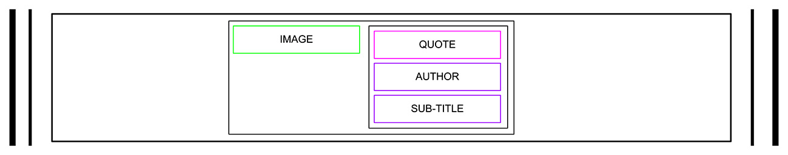

# Project Name: HTML, advanced

## Requirements

### General

* All your files should end with a new line
* A README.md file, at the root of the folder of the project is mandatory
* You are not allowed to install, import or use external libraries. This website must be build with only HTML/CSS/JavaScript. No NodeJS, React, VueJS, Bootstrap, etc.
* Your code should be W3C compliant and validate with W3C-Validator

## Tasks

> 0. README and objectives!

In this and coming projects, you will implement from scratch a webpage from a designer file.

For this first project, you will focus on the HTML structure only - no CSS, no style - just pure HTML semantic.

This designer file will be available on Figma - feel free to create an account to access the final result here:

* [Page in Figma](https://intranet.hbtn.io/rltoken/lhaBvvfXnyGKs9bRxokWtQ)
* [fig file](https://intranet.hbtn.io/rltoken/BOC4LSHhGgn-RudlXjuUKg)

And “Duplicate to your Drafts” to have access to all design details.

Important notes with Figma:

* if your computer doesn’t have missing fonts, you can find them here: source-sans-pro and Spin-Cycle-OT
* some values are in float - feel free to round them

For this task, please write an amazing README.md

---

> **1. Header**

Let’s start by the top: the header

Here the wireframe of it:

* Create the HTML skeleton (html, head, body, etc.)
* In the body, add an header tag
* Inside this header:
    * Add a link element with an image inside
    * Add a block of 3 link elements

File: `index.html`

---

> 2. Banner

Now, the banner under the header:

Under the header, add a main element with inside a section element.

In this section element, add:

* A block with inside:
    * An heading tag (don’t forget to use the correct heading value)
    * A text element
    * A button tag
* Another block with inside:
    * Another heading tag (same, be careful about which one you are using)
    * A block containing 4 blocks - each block with inside:
        * An image
        * An heading tag
        * A text

File: `index.html`

---

> 3. Quote

Under the banner, we will add the quote block:

The quote section is inside the main:

    * Create a new section for the quote
    * Inside, add a block containing:
        * An image
        * Another block with inside:
            * A quote tag
            * An author quote
            * A text

File: `index.html`

---

> 4. Videos

Let’s now add the videos list:

New section with inside:

    * An heading tag
    * A block containing the 4 video block - each of them are composed with:
        * An image
        * An heading
        * A text
        * A block for the author:
            * A image
            * An heading
        * A block for the rating:
            * A block of images (one star = one image)
            * A text

File: `index.html`

---

> 5. Membership

Membership section is similar as the videos list:

After the videos list section, add a new section containing:

    * An heading
    * A block with inside 4 block item - each block defined with:
        * An image
        * An heading
        * A text
    * A button

File: `index.html`

---

> 6. FAQ

The FAQ section is ending the page before the footer:

Add a section for the FAQ with inside:

    * A block that contains 2 “row block”
    * Each “row block” contains 2 “item block”
    * Each “item block” is composed of:
        * An heading
        * A text

File: `index.html`

---

> 7. Footer

And… the footer!

After the last section, outside of the main, add a footer:

    * A global block (used later for centering the footer content), inside this block:
        * A “row block” with:
            * An image
            * A block with inside:
                * Images with link
        * A text

And… that’s it for the moment - the result should not be shiny, don’t worry, CSS is coming…

File: `index.html`
